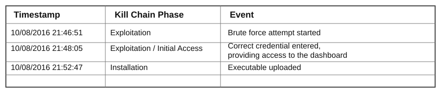
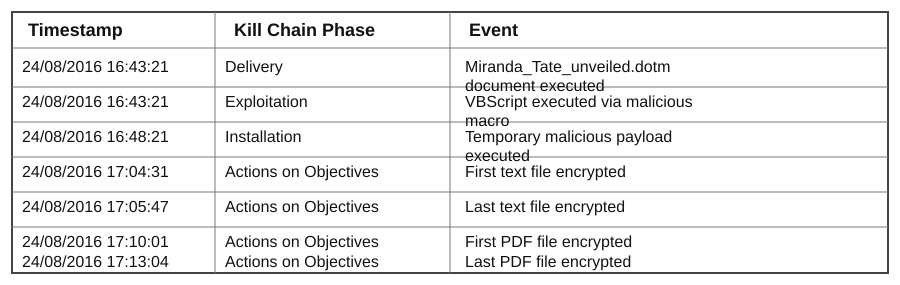

# Incident Timeline

This timeline brings the main events together in the order they happened. It helps show how the small pieces of log data formed two clear attack paths.

## Web server compromise

The Joomla administrator page was targeted first. The activity moved from repeated login attempts to a successful login and then to a file upload.

| Timestamp | Phase | Event | Why it matters |
|---|---|---|---|
| 10/08/2016 21:46:51 | Exploitation | Brute force attempt started | A large number of login attempts suggests automated password guessing. |
| 10/08/2016 21:48:05 | Exploitation / Initial Access | Correct credential entered and dashboard access was given | This shows that the login attack led to access. |
| 10/08/2016 21:52:47 | Installation | Executable uploaded | The attacker moved from gaining access to placing a file on the server. |

A total of **412 unique password attempts** were seen in about **90 seconds** from `23.22.63.114`. A later successful login came from `40.80.148.42`. The change of source address is important, so the two events are linked by the timing and follow-on activity rather than by assuming they came from the same system.

## Ransomware infection

The second attack started on the workstation and later reached the file server over SMB.

| Timestamp | Phase | Event | Why it matters |
|---|---|---|---|
| 24/08/2016 16:43:21 | Delivery | `Miranda Tate unveiled.dotm` was executed | This is the first clear step in the ransomware execution chain. |
| 24/08/2016 16:43:21 | Exploitation | VBScript was executed through a malicious macro | The document started scripted activity. |
| 24/08/2016 16:48:21 | Installation | Temporary malicious payload was executed | `121214.tmp` became the next step in the execution chain. |
| 24/08/2016 17:04:31 | Actions on Objectives | First text file was encrypted | Marks the start of the visible file impact. |
| 24/08/2016 17:05:47 | Actions on Objectives | Last text file was encrypted | 406 unique text files were affected during this period. |
| 24/08/2016 17:10:01 | Actions on Objectives | First PDF file was encrypted | Shows that the attack had reached the network file server. |
| 24/08/2016 17:13:04 | Actions on Objectives | Last PDF file was encrypted | 257 unique PDF files were affected on the file server. |

## What the timeline shows

The two timelines make the investigation easier to follow because each phase is tied to a real event in the logs.

For the web server, the important pattern is **login attack -> successful access -> file upload**.

For the ransomware case, the pattern is **document execution -> script execution -> temporary payload -> file encryption -> impact on a network share**.

These sequences were used to build the detection rules stored in `../detections/`.
