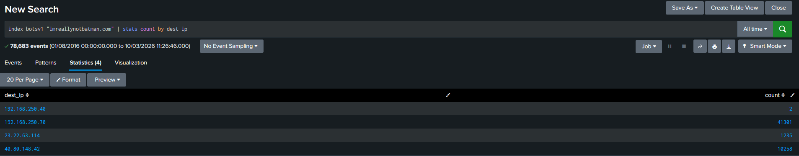
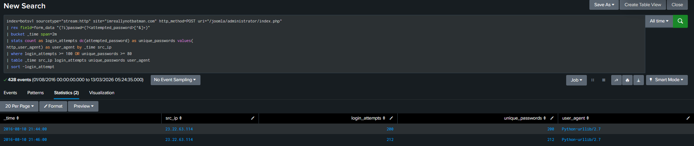
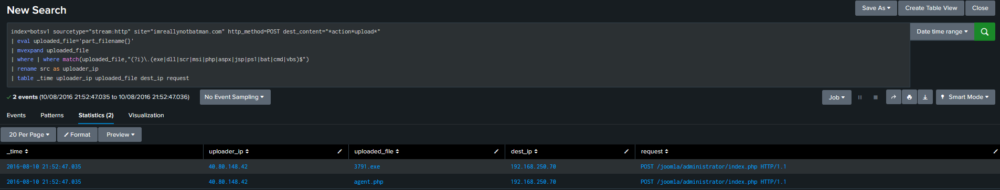
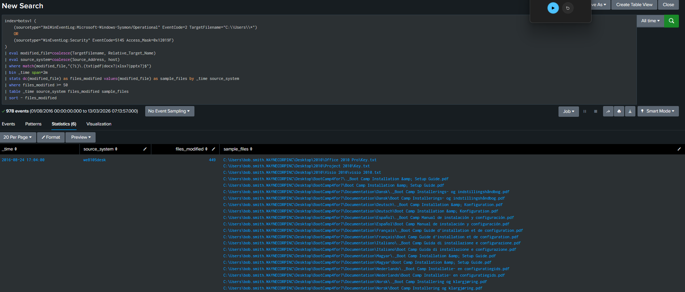
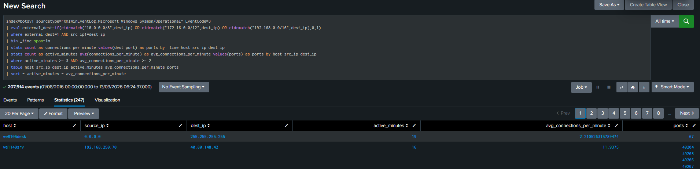
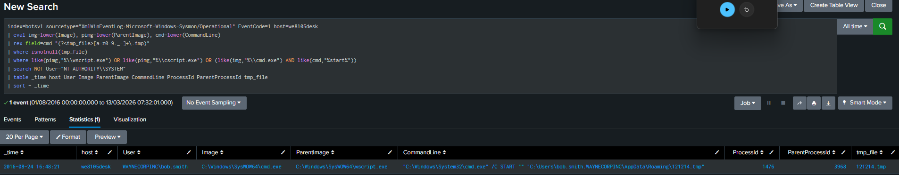

# Investigation Screenshots

These images show the main stages of the investigation in Splunk. They are shown in the same order as the investigation flow, starting with the initial search and then moving through the main detections and timelines.

## 1. Splunk overview

The initial Splunk search used to identify the main destination IP addresses in the investigation.

## 2. Brute force detection

This shows the large number of password attempts against the Joomla administrator page.

## 3. Malicious file upload

This shows the suspicious files uploaded to the Joomla web server after access was gained.

## 4. Ransomware detection

This shows the large number of file changes linked to the ransomware activity.

## 5. Web server attack timeline

This timeline shows the main events in the web server compromise, from the brute force attempt through to the file upload.

## 6. Ransomware attack timeline

This timeline shows the ransomware sequence from the malicious document being opened through to file encryption.

## 7. C2 behaviour detection

This shows the repeated outbound connections that were reviewed as possible command and control activity.

## 8. Temporary file execution

This shows the temporary payload execution that formed part of the ransomware process chain.

The screenshots can be read alongside the SPL files in `../detections/` and the written investigation in `../investigation/`.
